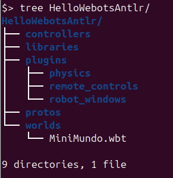
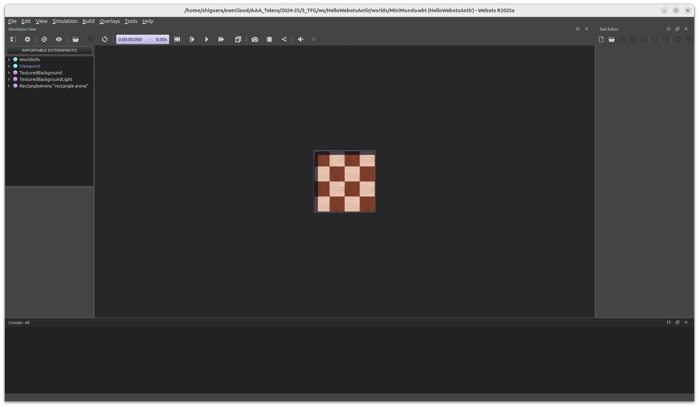
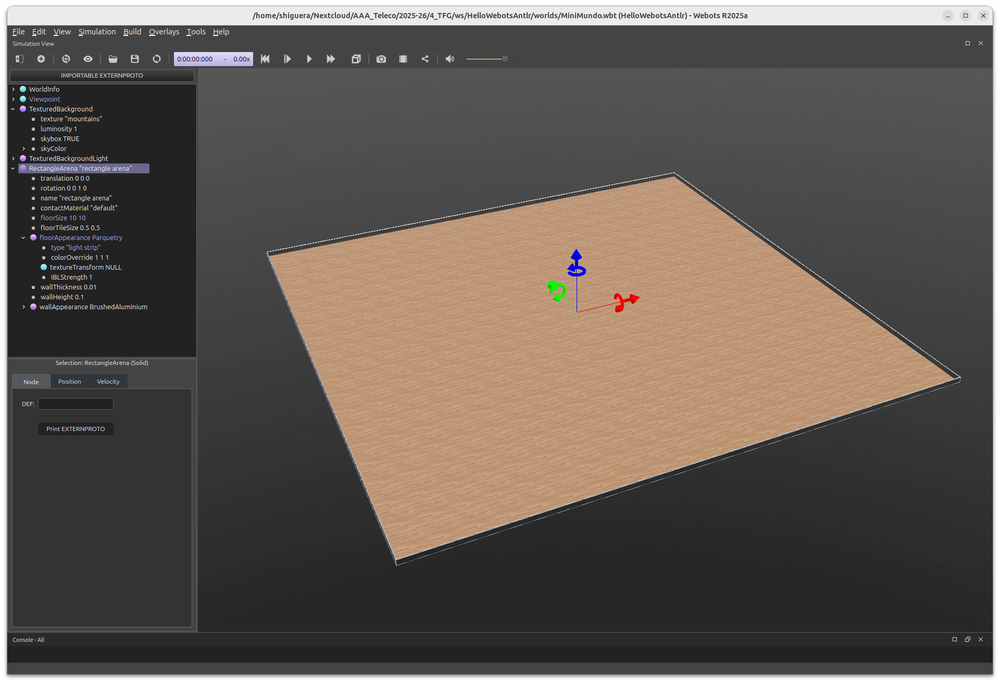
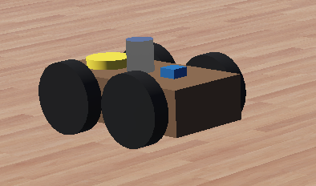

# HelloWebotsAntlr

## 1.- Creación del mundo en Webots

Para crear un nuevo proyecto en Webots:

```shell
File->New->New project directory
```

Esta opción ofrecerá un diálogo de ayuda en la creación del nuevo proyecto. Lo primero es elegir un nombre y una ubicación para el nuevo proyecto. En nuestro caso hemos elegido `HelloWebotsAntlr`. 

A continuación, hay que asignar un nombre al fichero del escenario 3D del proyecto y seleccionar las opciones que se ofrecen. En nuestro caso, hemos elegido:

- Nombre fichero mundo: `MiniMundo`. 

- `Center view point`.

- `Add a textured background`.

- `Add a directional light`.

- `Add a rectangle arena`.

Webots creará un directorio con el nombre del proyecto que hayamos elegido y, dentro de él, las carpetas que necesita un proyecto Webots, según la siguiente estructura:



[Doc: The Standard File Hierarchy of a Project](https://cyberbotics.com/doc/guide/the-standard-file-hierarchy-of-a-project)

[Doc: Nodes and Keywords](https://cyberbotics.com/doc/reference/nodes-and-keywords)

En Webots, se abrirá el mundo recién creado. La imagen será similar a la siguiente:



El único fichero que se crea es `MiniMundo.wbt`, dentro del directorio `worlds`del proyecto, que es el fichero del mundo recién creado. 

Los ficheros `.wbt` contienen la descripción de los escenarios 3D de los proyectos Webots. Son ficheros de texto plano que se pueden abrir con un editor de texto. El contenido del fichero `MiniMundo.wbt` recién creado es el siguiente:

```shell
#VRML_SIM R2025a utf8

EXTERNPROTO "https://..."
EXTERNPROTO "https://..."
EXTERNPROTO "https://..."

WorldInfo { }
Viewpoint {
  orientation -0.5773 0.5773 0.5773 2.0944
  position 0 0 10
}
TexturedBackground { }
TexturedBackgroundLight { }
RectangleArena { }
```

Como se ve, el fichero consta de los siguientes elementos:

- Una línea inicial obligatoria para declarar la versión del fichero `.wbt`.

- Tres declaraciones `EXTERNPROTO` para la importación de prototipos desde la dirección web de Webots (Los prototipos de `TexturedBacground`, `TexturedBackgroundLight` y `RectangleArena`).

- Los cinco `nodos` que componen el proyecto inicialmente: *WorldInfo*, *ViewPoint*, *TexturedBackground*, *TexturedBackgroundLight* y *RectangleArena*. 

Inicialmente, solo el nodo *ViewPoint* tiene atributos para fijar el punto de vista inicial del mundo, en este caso, una vista cenital (desde arriba).

Vamos a aumentar un poco el tamaño del rectángulo arena. Para ello, dentro de Webots, abre el nodo correspondiente en el árbol de la escena y modifica los valores de la propiedad `floorsize`, poniendo por ejemplo `10 10`. También puedes modificar el aspecto del rectángulo actuando sobre la propiedad `foorAppearance->type` y elegir, por ejemplo, `light strip`, que permitirá que se vea un poco más el Robot sobre el suelo. Tras hacer estas modificaciones debes pulsar el botón `Guardar`para que queden grabadas en el fichero del disco.

Tras hacer estas modificaciónes y actuar con el ratón en la pantalla para ajustar el punto de vista y el zoom, deberías ver tu nuevo mundo de manera similar a la de la siguiente figura:



## 2.- Añadir un robot al proyecto

Ahora, vamos a añadir un robot a la escena. Se trata de un robot sencillo creado por nosotros. Para ello, abre con el editor de texto el fichero `MiniMundo.wbt` y copia y pega al final del fichero el contenido del fichero `robot.txt`.

Esto añade un nodo `Robot`a nuestro mundo. Se trata de un Robot dotado de cuatro ruedas, con sus correspondientes motores, dos sensores de distancia situados en la parte delantera,  un GPS, una brújula y un lápiz. El GPS nos va a hacer falta para poder medir las distancias recorridas por el Robot y la brújula (*Compass*) permitirá medir los ángulos girados por el Robot.

Lo que hemos hecho es añadir un nodo del tipo `Robot` que dispone de los siguientes dispositivos (abre en Webots su nodo `children`):

- GPS

- Compass

- Pen

- Distance Sensor (2)

- 4 ruedas con motores

La documentación de estos dispositivos la puedes consultar en:

[Doc: Nodes and API Functions](https://cyberbotics.com/doc/reference/nodes-and-api-functions)

El aspecto del robot es el siguiente:



Una vez que modifiques el fichero `wbt`, para ver los cambios en Webots, tendrás que volver a abrir el mundo con `File->Open World`.

## 3.- Añadir un controlador para el Robot

Si has seguido los pasos anteriores, en la consola de la parte inferior de Webots se marcarán unos errores, indicando que no se encuentra el controlador `SimpleController`. 

Si observas la última línea del código de `robot.txt`, verás que pone `controller: SimpleController`. En los nodos del tipo `Robot`, hay que especificar el `controlador` del robot, que es una clase java compilada (`.class`).  Lo que hace Webots es buscar una clase java compilada llamada `SimpleController.class` dentro del directorio `controllers/SimpleController`del proyecto. 

Vamos a dividir el controlador del robot en dos clases Java: la clase `SimpleVehicle` deriva de la clase Robot de Webots y contiene toda la lógica que permite manejar el Robot; la clase `SimpleController`será el controlador propiamente dicho.

El código java de las dos clases lo puedes encontrar en el directorio `controllers/SimpleController` del proyecto, en los ficheros `SimpleVehicle_0.java` y `SimpleController.java`. 

Echa un vistazo al código: `SimpleVehicle`deriva de la clase `Robot`de Webots y añade propiedades y métodos para manejar el Robot.  `SimpleController.java` es la clase que tiene el método *main()* que instancia el `SimpleVehicle_0` y llama a alguno de sus métodos. El código del controlador es el siguiente:

```java
public class SimpleController {
   static SimpleVehicle_0 robot;

   public static void main(String[] args) {

      int TIME_STEP = 32;
      
      robot = new SimpleVehicle_0(TIME_STEP);
      
      robot.moveForward(0.8, 1);
      robot.pivotAngle(45.0);
      robot.moveForward(0.8, 1);
      robot.pivotAngle(45.0);
      robot.moveForward(0.8, 1);
   }
}
```

Como ves, lo único que hace el controlador es crear un robot del tipo `SimpleVehicle_0` y enviarle instrucciones.

Tienes que compilar las dos clases `.java`que hemos copiado en el directorio `controllers/SimpleController` del proyecto. Lo puedes hacer de dos maneras: por consola o desde tu editor (VSCode, IntelliJ,...). En ambos casos vas a necesitar utilizar la librería `Controller.jar`que proporciona Webots (En mi instalación, está en el directorio `/home/shiguera/webots/lib/controller/java/Controller.jar`). 

 Para compilar por consola, tienes que abrir un terminal situado en el directorio `controller/SimpleController`del proyecto (Recueda que para abrir un terminal en un directorio determinado, puedes navegar hasta él con el explorador de archivos, pinchar con el botón derecho del ratón y elegir *abrir en terminal*). Tendrás que teclear la siguiente instrucción:

```shell
javac -cp .:/home/shiguera/webots/lib/controller/java/Controller.jar *.java
```

**Nota 1:** el argumento del parámetro `-cp` (*class path*) indica al compilador de Java dónde tiene que buscar las clases que necesita para compilar los ficheros `.java`. En este caso, se indican dos directorios: el directorio actual (`.`) y el directorio en el que se encuentra la biblioteca `Controller.jar` de Webots. En tu caso, el directorio de `Controller.jar` será el que se corresponda con tu instalación de Webots.

**Nota 2:** si estás trabajando en Windows, hay dos diferencias que tienes que tener en cuenta en relación con el parámetro *class path* de Java. En primer lugar, las rutas se separan con `;` (punto y coma), no con `:` como en Linux. En segundo lugar, el separador de carpetas dentro de una ruta es la barra invertida `\`, no la barra inclinada normal.

Una vez compiladas las clases `SimpleVehicle` y `SimpleController` sin errores, prueba a recargar la simulación en Webots y deberías ver al robot moviéndose por el rectángulo, siguiendo las instrucciones que le hemos dado en el controlador.

**Nota 3:** con el tipo de suelo que hemos puesto, no se ve el trazo que va dejando la pluma. Más adelante explicaré cómo sustituir este suelo por otro más adecuado.

## Controlador en nuestro lenguaje

Ahora, vamos a hacer lo mismo, pero dando al robot las instrucciones a través de un fichero escrito en nuestro propio lenguaje.

Crea un nuevo directorio dentro del directorio `controllers` del proyecto, llamado `ControladorAntlr` y copia dentro de él el fichero `SimpleVehicle.java`.

En lo que sigue, vamos a necesitar la librería de `antlr`. En mi caso es el fichero `antlr-4.13.2-complete.jar`. Copialo en el directorio *libraries* del proyecto.

**Paso 1:** crear la gramática del proyecto. Por facilidad, la vamos a crear en el mismo directorio del controlador. Crea un fichero llamado `Webots.g4` y copia el siguiente contenido dentro de él:

```shell
grammar Webots;

prog: statement+ ;

statement:  'AVANZA' '(' VALUE ',' VALUE ')' '\n' #Avanza
            | 'GIRA' '(' VALUE ')' '\n' #Gira
            ;

VALUE:      INT
        |   FLOAT
        ;

INT : DIGIT+ ;
FLOAT : '-'? DIGIT+ '.' DIGIT*
        | '-'? '.' DIGIT+
        ;
fragment DIGIT : [0-9] ;

WS : [ \t\n\r]+ -> skip ;
```

La gramática solo incluye dos posibles instrucciones: `AVANZA` y `GIRA`. La primera recibe dos parámetros (velocidad y distancia) y activará el método `moveForward` del `SimpleVehicle`. La segunda recibe un solo parámetro (ángulo) y activará el método `pivotAngle` del `SimpleVehicle`.

Ahora vamos a crear con *ANTLR* el lexer y el parser correspondientes a esta gramática. Para ello, abre un terminal en el directorio `controllers/ControllerAntlr` del proyecto, el directorio donde está la gramática y teclea la siguiente orden:

```shell
java -cp ../../libraries/antlr-4.13.2-complete.jar org.antlr.v4.Tool 
   Webots.g4
```

**Nota:** si estás trabajando con IntelliJ, esta instrucción equivale a activar la opción `Generate Antlr recognizer`del menú que aparece al pinchar con el botón derecho del ratón sobre el fichero de la gramática.

Si todo ha ido bien, se crearán varios ficheros. Los que nos interesan son los ficheros `.java`y, en particular, el fichero `WebotsBaseListener.java`, que es del que derivaremos nuestra clase para interpretar el lenguaje.

Tenemos que compilar todos estos ficheros. Una vez más, necesitaremos usar la librería `antlr`. La instrucción para compilar es:

```shell
javac -cp .:../../libraries/antlr-4.13.2-complete.jar Webots*.java
```

**Nota 1:** en el parámetro `-cp` (*classpath*), que es donde va a buscar el compilador *javac* las clases,  hemos puesto dos rutas: el directorio actual (`.`) y la librería de *antlr*. En windows, el separador de estas rutas es `;`, en lugar de dos puntos y la separación de carpetas se hace con la barra invertida `\`.

**Nota 2:** si estás trabajando con IntelliJ, es posible que la compilación se haga automáticamente. 

Ahora vamos a crear nuestra clase intérprete del lenguaje. Crea un fichero llamado `WebotsMyListener.java`  y copia el siguiente código dentro de él:

```java
public class WebotsMyListener extends WebotsBaseListener {

    static SimpleVehicle robot;

    public WebotsMyListener(SimpleVehicle robot) {
        WebotsMyListener.robot = robot;
    }

    @Override
    public void enterAvanza(WebotsParser.AvanzaContext ctx) {
        double v = Double.parseDouble(ctx.VALUE().get(0).getText());
        double d = Double.parseDouble(ctx.VALUE().get(1).getText());
        System.out.println("AVANZA("+v+", "+d+")");
        robot.moveForward(v, d);
    }
    @Override
    public void enterGira(WebotsParser.GiraContext ctx) {
        double angle = Double.parseDouble(ctx.VALUE().getText());
        System.out.println("GIRA "+angle);
        robot.pivotAngle(angle);
    }
}
```

Para compilar, tendremos que utilizar las dos librerías: la de *antlr* y la de *webots*. La instrucción de consola es la siguiente:

```shell
javac -cp .:../../libraries/antlr-4.13.2-complete.jar:
   ../../libraries/Controller.jar 
   WebotsMyListener.java
```

Si estás trabajando con IntelliJ, para que compile, deberás decirle que use la librería de *webots Controller.jar*, además de la de *antlr*.

Ahora vamos a crear el controlador. Crea el fichero `ControllerAntlr.java` y copia el siguiente contenido dentro de él:

```java
import java.io.IOException;

import org.antlr.v4.runtime.CharStream;
import org.antlr.v4.runtime.CharStreams;
import org.antlr.v4.runtime.CommonTokenStream;
import org.antlr.v4.runtime.tree.ParseTree;
import org.antlr.v4.runtime.tree.ParseTreeWalker;

public class ControllerAntlr {
   static SimpleVehicle robot;

   public static void main(String[] args) throws Exception {

      int TIME_STEP = 32;

      robot = new SimpleVehicle(TIME_STEP);

      initParser();

   }

   static void initParser() throws IOException {
      CharStream input = CharStreams.fromFileName("instrucciones.txt");
      WebotsLexer lexer = new WebotsLexer(input);
      CommonTokenStream tokens = new CommonTokenStream(lexer);
      WebotsParser parser = new WebotsParser(tokens);
      ParseTree tree = parser.prog();
      ParseTreeWalker walker = new ParseTreeWalker();
      walker.walk(new WebotsMyListener(robot), tree);
   }
}
```

Tienes que compilar la clase del controlador:

```shell
javac -cp .:../../libraries/antlr-4.13.2-complete.jar:
    ../../libraries/Controller.jar 
    ControllerAntlr.java
```

Solo queda un paso: hay que decirle a Webots donde encontrar la librería de *antlr*. Para ello, crea un fichero llamado `runtime.ini` dentro del directorio `ControllerAntlr` del controlador y copia el siguiente contenido:

```shell
[environment variables with paths]
CLASSPATH = /home/shiguera/ownCloud/AAA_Teleco/2024-25/3_TFG/ws/
    HelloWebotsAntlr/libraries/antlr-4.13.2-complete.jar
```

La ruta del código anterior es la que corresponde a mi instalación. En tu caso, tendrás que poner la ruta completa a tu librería *antlr*.

Hay que crear el fichero `instrucciones.txt` con la intrucciones que queremos que realice el robot. En mi caso, he rerpoducido las intrucciones del ejemplo del `SimpleController`:

```shell
AVANZA(0.8, 1)
GIRA(45.0)
AVANZA(0.8, 1)
GIRA(45.0)
AVANZA(0.8, 1)
```

Ahora, en Webots, hay que cambiar el controlador del robot y decirle que use `ControllerAntlr`. Si todo ha ido bien, el robot se debería mover como antes pero, esta vez, siguiendo las instrucciones del fichero `instrucciones.txt`.

## Controladores externos

Están en el directorio `external_controllers` y hay unos ficheros `README.md` en cada directorio, explicando cómo arrancarlos invocándolos desde la consola.
