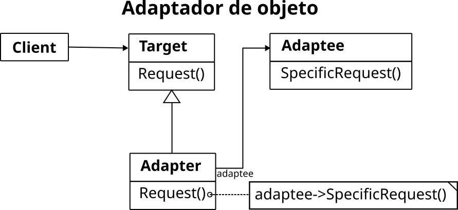

Este proyecto muestra cómo usar un lenguaje que puede servir para manejar distintos tipos de robots.

El lenguaje se ha llamado RoboLang y está desarrollado en el directorio (paquete) `lenguaje`. La gramática es `RoboLang.g4`.

La biblioteca `antlr-4.13.2-complete.jar` se ha guardado en el directorio `lib`.

Para compilar la gramática en Linux hay que situarse en el directorio `lenguaje` y teclear:

```shell
java -cp ../lib/antlr-4.13.2-complete.jar org.antlr.v4.Tool RoboLang.g4
```

Como resultado de la compilación de la gramática, se crearán:

- `RoboLangLexer.java`: es el analizador léxico del lenguaje (*lexer*). 
- `RoboLangParser.java`: es el analizador sintáctico (*parser*).
- `RoboLang.tokens` y `RoboLangLexer.tokens`: archivos auxiliares necesarios durante la interpretación del código fuente.
- `RoboLang.interp`y `RoboLangLexer.interp`: archivos auxiliares que se utilizan si se crean LexerInterpreter y ParserInterpretes. Son herramientas de debugging que permiten probar cambios en las gramáticas sin tener que recompilar todo. Yo no lo uso. Se podrían borrar.
- `RoboLangListener.java`: es el interface que deben implementar los interpretes del lenguaje. Los métodos son llamados al recorrer el árbol sintáctico generado. Contiene un método de entrada y otro de salida para cada regla no terminal del lenguaje.
- `RoboLangBaseListener.java`: es una clase abstracta, que implementa el interface anterior y tiene una implementación vacía de los métodos. Nuestro interprete tendrá que derivar de esta clase y sobrescribir los métodos que quiera utilizar.

En nuestro caso, queremos implementar un intérprete del lenguaje que ejecute el código fuente en distintos tipos de robots: robot Webots, robot StdDraw y robot de consola.

Vamos a utilizar el patrón de diseño *Adaptador de objeto*:



En nuestro caso, el cliente es el intérprete del lenguaje que es la clase `main/Interprete.java`. El *Target* es el interface `RoboLangListener` o la clase `RoboLangBaseListener`. El objeto que queremos adaptar es `RobotWebots`o `RobotStdDraw`u otros. Los adaptadores que hemos implementado son `WebotsListener.java`y `StdDrawListener.java`. 


Para ejecutar el intérprete con un robot concreto, habrá que llamar al controlador del robot, que se encarga de instanciar el intérprete y traducir el fichero con el código fuente:

- `robolang_webots_controller.java`: controlador del robot de Webots. Se encarga de instanciar `Interprete` y mandarle ejecutar el código fuente. Hay que ejecutarlo como *controlador externo* de Weobots. Debido a la estructura de paquetes del proyecto, no funciona como controlador interno. Para ejecutarlo, situados en el directorio principal del proyecto:

```shell
java -cp .:lib/Controller.jar:lib/antlr-4.13.2-complete.jar \
   -Djava.library.path=lib \
   robolang_webots/controllers/robolang_webots_controller/robolang_webots_controller
```

Hemos copiado las librerías estáticas y dinámicas necesarias en el directorio `lib`. En Linux, habrá que fijar la variable de entorno `LD_LIBRARY_PATH` apuntando al directorio de las librerías dinámicas de Webots (`$WEBOTS_HOME/lib/controller`). En Windows la variable de entorno que hay que usar es `PATH`.

- `robolang_stddraw_controller`: controlador del robot de StdDraw. Se encarga de instanciar el `Interprete` y mandarle ejecutar el código fuente. Para ejecutarlo, situados en el directorio principal del proyecto:

```shell
java -cp .:lib/antlr-4.13.2-complete.jar robolang_stddraw.robolang_stddraw_controller
```

He creado una clase `main/Menu.java` que muestra un menú y permite elegir el fichero fuente y el robot. Para ejecutarla, situados en el directorio principal del proyecto:

```shell
java -cp .:lib/Controller.jar:lib/antlr-4.13.2-complete.jar \
    -Djava.library.path=lib \
    main.Menu
```

También he creado unos ficheros bash que permiten compilar o ejecutar: `compilar`, `ejecutar`.
